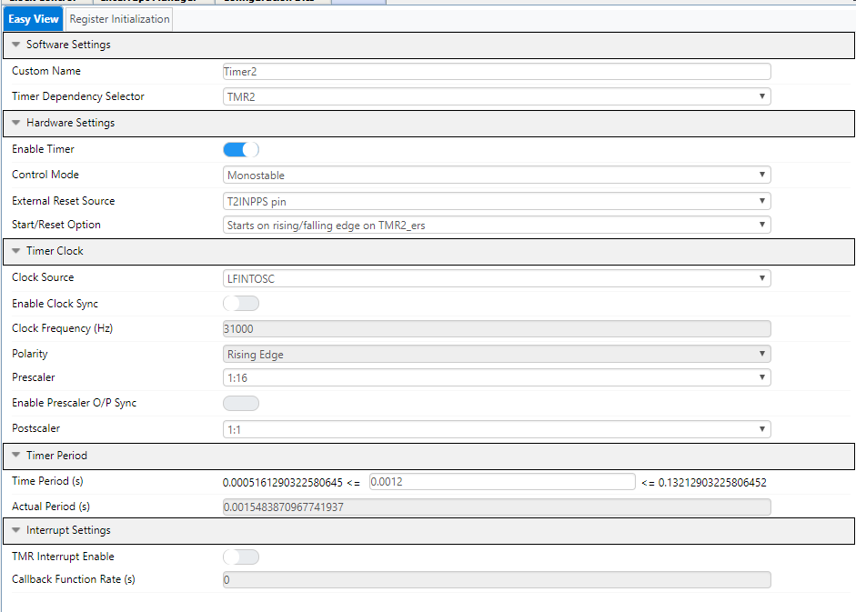
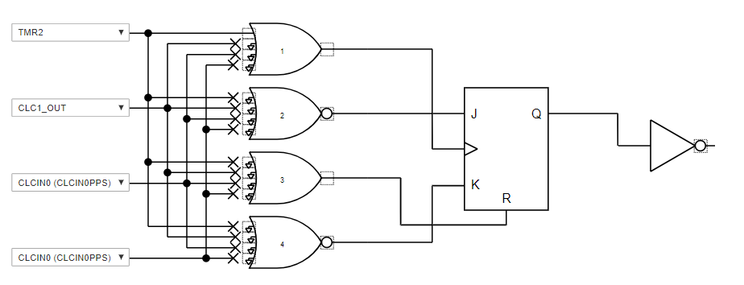
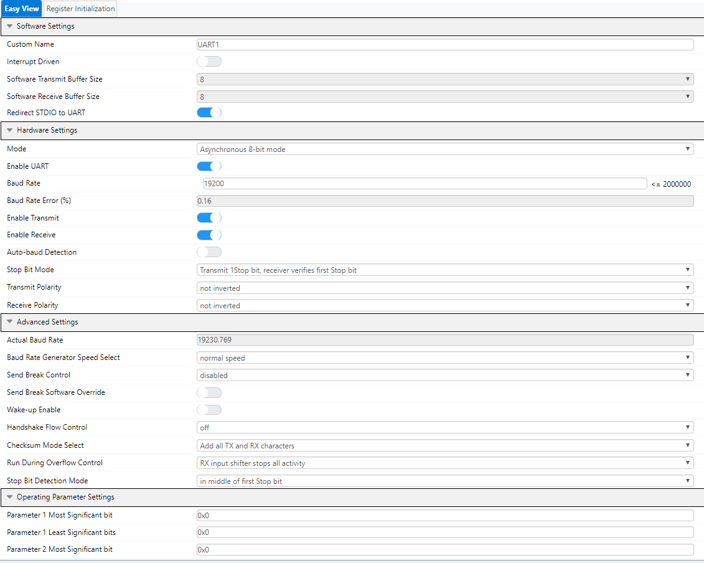
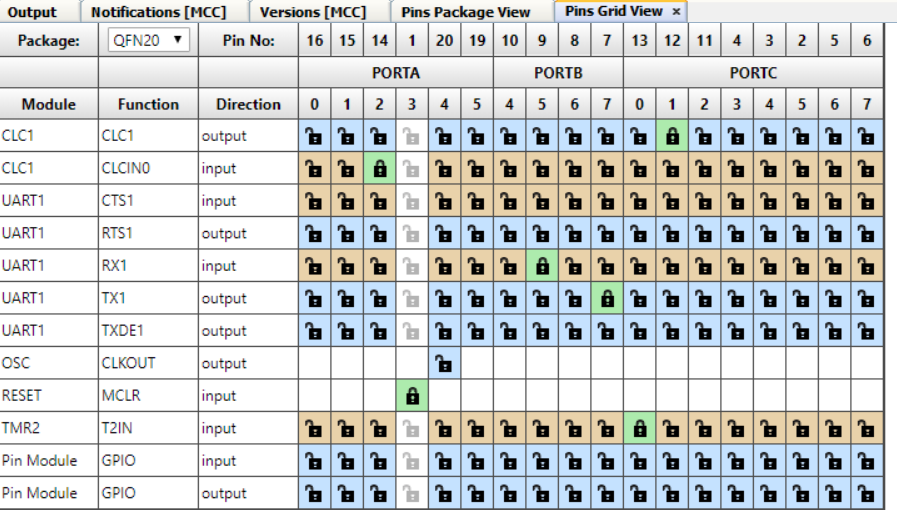
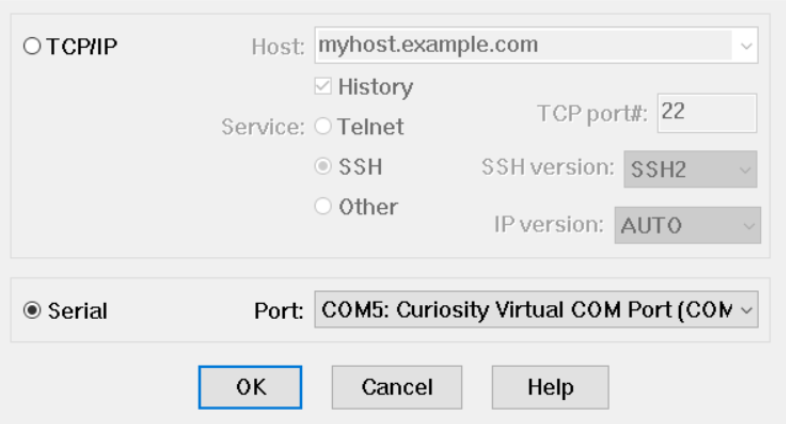
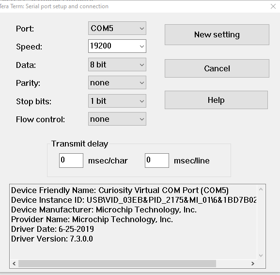
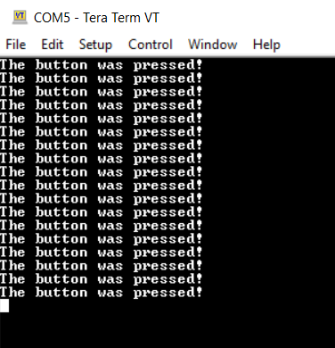

[](https://www.microchip.com)

# Printing a message on a serial terminal when the pushbutton is pressed on a PIC18F16Q41
  In this example, a push-button will be debounced using the Configurable Logic Cell (CLC) and Timer 2 (TMR2) peripherals on the PIC18F16Q41. When this occurs, the UART peripheral will print a message to a serial terminal.


## Related Documentation

* [PIC18F16Q41 Datasheet](https://ww1.microchip.com/downloads/en/DeviceDoc/PIC18F06-16Q41-DataSheet-40002214C.pdf)

* [PIC18F16Q41 Device Page](https://www.microchip.com/wwwproducts/en/PIC18F16Q41)

* [PIC18F16Q41 Curiosity Nano Users Guide](https://ww1.microchip.com/downloads/en/DeviceDoc/PIC18F16Q41-Curiosity-Nano-Hardware-User-Guide-DS50003048A.pdf)

## Software Used

* [MPLAB® X IDE](https://www.microchip.com/en-us/development-tools-tools-and-software/mplab-x-ide)
* [MPLAB Code Configurator (MCC)](https://www.microchip.com/mplab/mplab-code-configurator)
* [MPLAB XC8 Compiler](https://www.microchip.com/en-us/development-tools-tools-and-software/mplab-xc-compilers)

* [MPLAB Data Visualizer Plugin](https://www.microchip.com/en-us/development-tools-tools-and-software/embedded-software-center/mplab-data-visualizer) or other serial terminal

## Hardware Used

* [PIC18F16Q41 Product Information](https://www.microchip.com/wwwproducts/en/PIC18F16Q41)


## Setup

**Step #1: Creating the Project**
+ On the tool bar, click on New Project
+ Microchip Embedded; Standalone Project
+ Enter the Device
  + For this Project: PIC18F16Q41
+ Enter a name for this project, such as *uart-button*
  + Name: “uart-button”
  + **Note: The project name cannot have any empty spaces**

When a pushbutton is pressed, the internal contacts in the switch will bounce momentarily, causing the digital value read to vary wildly. This can create false detections of button press and release. To remove the contact bounce from the digital input, a CLC and TMR2 are used to create a debouncer.


  **Step #2: MPLAB Code Configurator (MCC)**

  + Set Configuration Bits
    + Disable "External Oscillator Mode Selection"
    + Set "Power-up Default Value for COSC" to "HFINTOSC with HFFRQ = 64MHz and CDIV = 1:1"
    + Ensure that "WDT Operating Mode" is set to "WDT Disabled; SWDTEN is ignored"


  +	Modify the Clock Control
    +	Set “Clock Source” to High Frequency Internal Oscillator (HFINTOSC)
    + Set “HF Internal Clock” to 64_MHz
    + Set “Clock Divider” to 1

**Step #3: Adding Timer, CLC and UART Peripheral**

+ In Device Resources:
    + Drivers &rarr; Timer &rarr; TMR2
    + Drivers &rarr; CLC &rarr; CLC1
    + Drivers &rarr; UART &rarr; UART1

**Once the peripherals are added, modify the peripherals:**

+ TMR2
  + Hardware Settings
    + ***Control Mode:*** Monostable
    + ***Start/Reset Option:*** Starts on rising/falling edge on TMR2_ers
  + Timer Clock
    + ***Clock Source:*** LFINTOSC
    + ***Prescaler:*** 1:16
    + ***Potscaler:*** 1:1
  + Timer Period(s)
    + ***Time Period (s):*** 0.00012



+ CLC1
  + Mode: "JK flip-flop with R"
  + Set TMR2 and CLC1_OUT to the top two logic gates respectively in the CLC1 configuration
    + Invert the OR gates that are connected to the J and K inputs



+ UART1
  + Software Settings:
    +	Enable "Redirect STDIO to UART" in order to use the function (printf) for sending messages.
  + Hardware Settings:
    +	Enable UART box should be checked
    + Enable transmit and Receive should be checked
    + Set the Baud Rate to 19200
    + Everything else can be left as default settings





  **Step #4: Configure the Pins**
  + **TX1** is connected to pin RB7
  + **RX1** is connected to pin RB5
  + Connect **TMR2** input to RC0
  + Connect **CLC1** output to RC1



  **Step #5: Generate the project**
  + Click the generate button in MCC to create the appropriate header and source files for this configuration


  **Step #6: Modifying main.c**
  + Upon the generation being completed, the new MCC generated header and source files will be in the project window. Select the main.c file and you will see an empty while(1) loop where you can add your application code.
  + The function **CLC1_OutputStatusGet()** will be implemented in the source code to poll the output of the CLC directly from the hardware.  
  + Select on the source files and open the “main.c” file
    + Before the while loop, define a boolean named **pressed** and assign false.


```     
  bool pressed = false;
    while (1)
   {
       if ((!pressed) && (CLC1_OutputStatusGet())) {
               printf("The button was pressed!\n\r");
               pressed = true;
       }
       else if ((pressed) && (!CLC1_OutputStatusGet()))
       {
           pressed = false;
       }

   }
  ```


  + Make and Program the Device


  **Step #7: Terminal Emulator**

  + For this project, the terminal emulator program that is being used is TeraTerm
  + Open up the serial terminal on the host computer and select the COM port associated with the Curiosity Nano.

  

  +  Configure the serial terminal to communicate at 19200 baud, no parity, and 1 stop bit.
    + Setup &rarr; Serial Port &rarr; Speed: 19200 &rarr; New Setting

  

  + If everything is setup correctly, then the serial terminal should start displaying the printf statement when the pushbutton is activated.

  

  The figure below shows the output wave form of the pushbutton and the CLC output, Yellow is the pushbutton and blue is the CLC output.


  


## Summary

This application demonstrates how to debounce a pushbutton.
